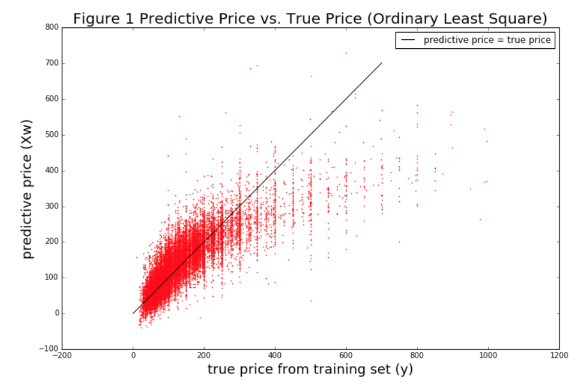
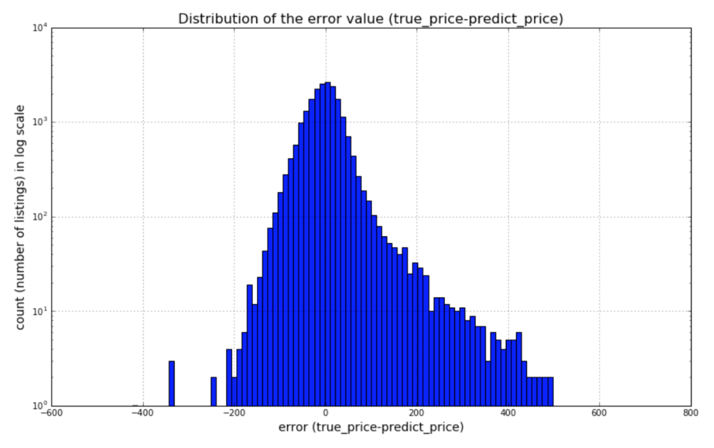
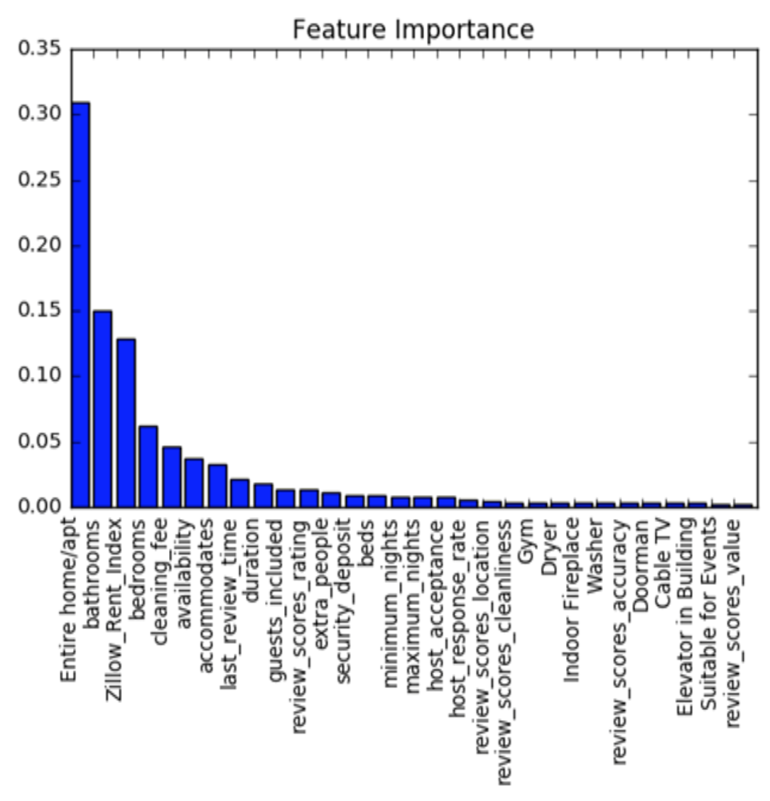
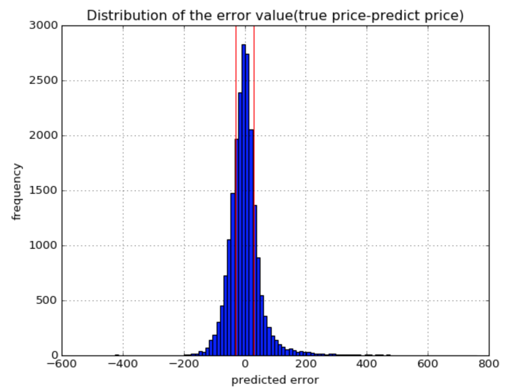
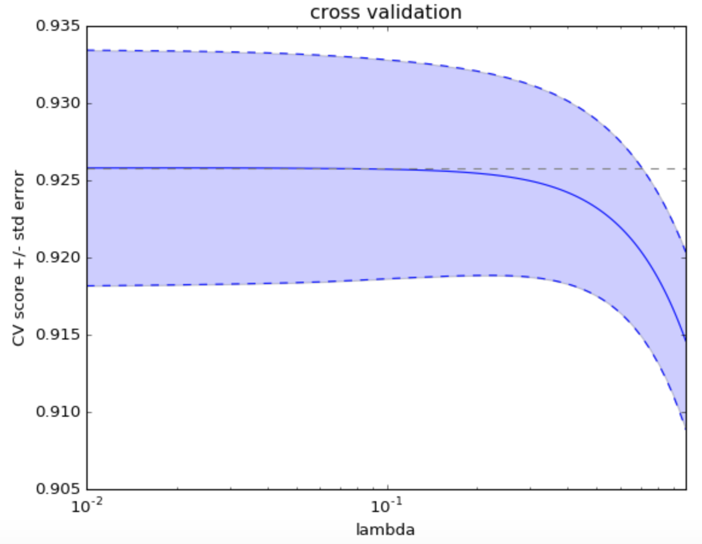
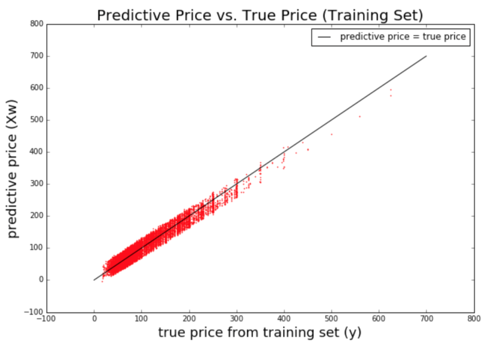
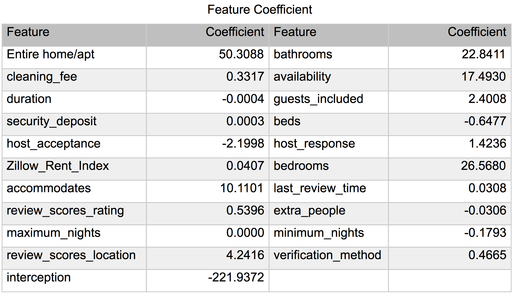
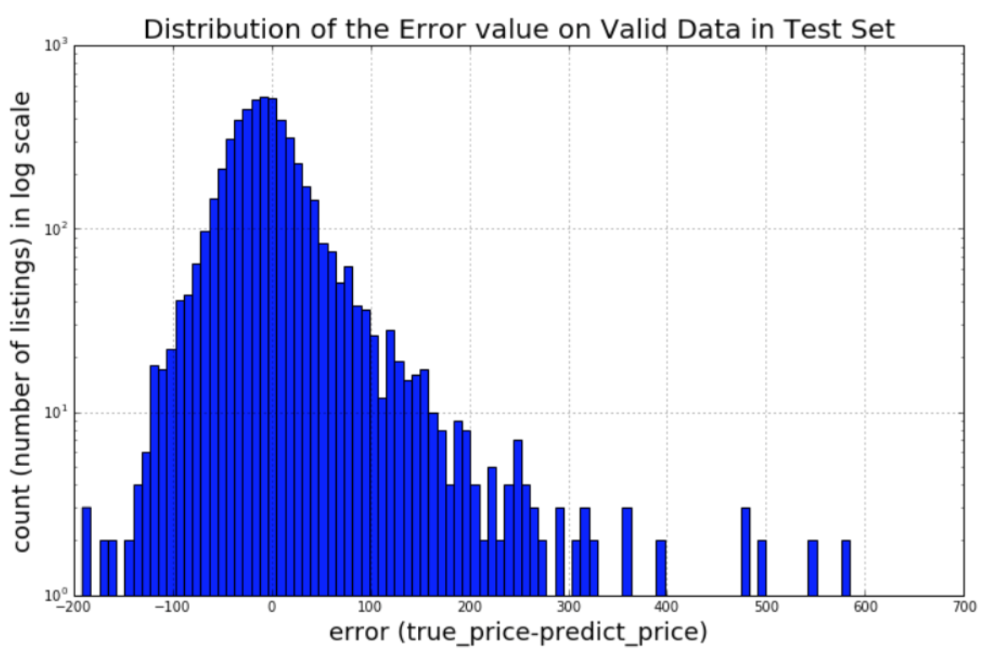

<b><title>ORIE4741 Airbnb project</title></b>

<h3>A data mining project studying Airbnb's data at Cornell University, with Dr. Madeleine Udell</h3>

### Introduction

From thousands of listings in different cities, Airbnb has become a massive sink of information. Data provided by homeowners are often big, messy, yet, extremely useful. The goal of this project is to extract knowledge from these datasets by  applying techniques and methodologies common in data mining.

As more homeowners put their properties on the platform, Airbnb is able to suggest appropriate prices for the listings based on machine learning models trained over large sets of data. Our team aims to predict the prices of the listings in New York City, to allow homeowners to price their properties appropriately. Specifically, we seek to answer the following question: What prices should Airbnb suggest to their hosts given a set of features about the listing? This question is important because as more data becomes available, more intelligence can be extracted using modern machine learning tools. Therefore, it is worthwhile in exploring data driven analyses similar to those presented in this report as they are likely to improve experience for both hosts and customers, and ultimately add value to the company.

### Goal and Assumption

The goal of the predictive models is clear - input the listing features X to the model, output the listing price y. However, we do not want to predict all listing prices y. We only want to to predict the price y which is reasonable and acceptable to the guest, so our model can provide the reliable price recommendation to the hosts. 

Since we do not have the transaction records of the Airbnb listings. We assume that not all listings had successful transactions, i.e. new listings that had no customers. We further assume the listings being reviewed by guests frequently are more reasonable and acceptable to the guest. Therefore, we filtered out the listing which does not have any review score. Those listings might have unreasonable characteristics which deter the guests to rent, such as extreme high price or lack of security. We had to discard about 10,000 listings that either has no reviews or no prices. We eventually have about 28,000 listings remaining in our data set.

### Feature Engineering

The Airbnb listing data we collected contains listing data from New York City from InsideAirbnb. The data file has around 38,000 listings scraped on July 3rd, 2016, and contains 100 features. Among these features are listing price, room type, amenities, and location etc. Other features include host information, room layout, amenities provided, policy, listing prices and review scores. Many of the features are non-numeric, namely, they are booleans, categorical and texts. While most features can be converted into numeric values, others will be left as booleans, categoricals, and texts and treated with appropriate regression tools. Our data set ends up having 96 features remaining.

* Amenities

The listings contain around 100 features, including numerical, and non-numerical features. For example, the amenities of a listing, i.e. TV, and WIFI, are contained in a array. Since many of the amenities are common to many properties, we began the feature transformation with the one-hot encoding method. Using this technique, we first summarized all amenities into a set of 35 unique amenities across all listings. We then expand each listing by 35 features, each representing a unique amenity initialized to zero or false. Next, we integrate through each listing and check its array of amenities. In the 35 additional columns, we set the corresponding feature to 1 or true if the same feature is found in the array. We repeat this sequence through all 28,000 plus listings, setting each entry to one to indicate an amenity. As a result, all amenities in our set are encoded by the addition of 35 new columns. We now delete the original column of arrays, leaving the one-hot encoded columns to indicate the presence of an amenity within a listing.

* Bed types

There are only 5 bed types for each listing, including Airbed, Couch, Futon, Pull-out sofa, and Real Bed. We are applying the same encoding method here, where each bed type is indicated by 1. As a result, we added five new columns of one-hot encoded features.

* Booleans

Lastly, we have many features with boolean values which indicate the characteristics of the listing and the host. For example, through these values we know whether this host is a superhost, and whether this is a instant-bookable or 24-hour check-in listing.

## Linear Regression

To begin, we build a linear model by applying ordinary least square regression on the listing data set X to predict the listing price y. Unfortunately, the linear models do not perform well. Figure 1 shows that the model underpredict the price when the true price is high. We can see the error distribution is skewed to positive direction in figure 2, which means that we have more predictions with positive error than with negative error. 

  Random forest

## Random forest

There are 92 features in our Airbnb data, we want to get an intuitive sense of what the most important features are, in contributing to the pricing difference among houses. Random forest is a very essential tool to help us look into the importance of these features. 

We use the importance generated by random forest as the weight of each feature that contribute to the Airbnb house pricing. As we can see from the plot, only the first 20 features will influence the house price significantly.

## Model Optimization

After getting the result of the random forest, we reduced the dimension of features. The top 20 important factors from that result will be included in the linear regression model. The whole dataset was also divided into training set and test set randomly, each with 80% and 20% of the entries respectively.

Using quadratic loss function with one norm regularizer, our linear model can learn the weight of different features, under less influence of outliers. Scikit-learn provides this function for us. To get the best fitting lambda, we ran k-fold cross validation with k=5. 
   

<h2>Outlier Classification</h2>

To overcome the underfitting problem mentioned above, we decided to build a classifier to indicate whether our model will predict the price well or not. Our model tends to underpredict the listings with higher prices, and overpredict the listings with lower prices. It is hard to predict those listings because they might have some unique characteristics which we do not extract from our dataset, such as text description or image.  Therefore, we want to ignore those listings with large negative or positive error,  and we regard them  as outliers. 

We are separating data points based on their error between the predicted prices and the actual. The graph below shows a histogram of errors divided into two parts; points inside the region bounded by the two lines are within 30 dollars of the actual price and are clustered into the “+1” category. Listings outside the region are labeled “-1”, since their errors are more than 30 dollars.

We then build a classification model using logistic regression, in order to classify a listings as valid data or outliers. Using this classification model, we will only apply the linear models to the listings which are classified as valid data.

## Linear Regression on the Valid Data

Then, we redo the linear regression on the valid data(listings within the bounded region), which means our final model only focuses on normal listings. Using linear regression followed by a k-fold cross validation, we got the coefficient of each feature and found the best lambda. The left figure shows the variance score of models with different lambda. The blue region means 95% confidence interval of the variance score. Variance score is the value between 0 and 1, which is 1 when the prediction exactly match the true price. The right figure shows that the updated linear regression model results in good prediction on the training set. 

Based on the results we got from the linear regression model, features such as room type, number of bathrooms, availability and number of guests included have a positive impact on the listing price, which means meeting tourists requirements in these fields helps a lot if hosts want to earn more. Other features such as fee for extra people and setting minimum number of nights will lower the probability of setting a welcomed high price.
Then apply this model onto test set. To see the prediction on the test set, we first classify the test set and get the result of 4392 valid data out of 5241 data points, which means that near 90% data in the test set is regarded as valid. Even though we  the classification process filters out the outlier and thus narrowed down our project scope, we were still predicting listing price for majority hosts. 
Then, we only apply the linear model on those 4392 valid data points. As the result shown in the two figures below, we still cannot predict the test set well. Then we face a problem of overfitting.

