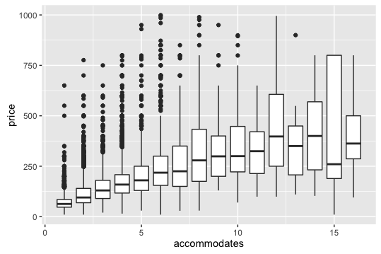
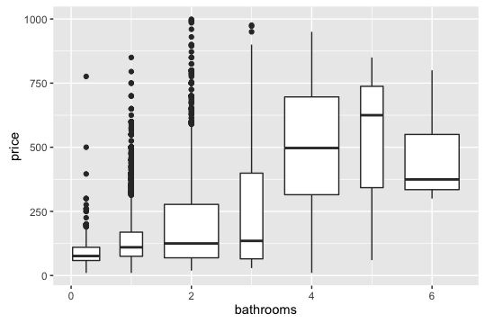
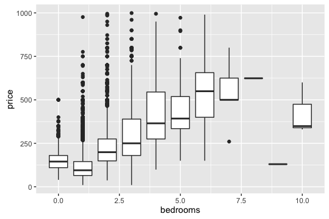

### ORIE 4741 Midterm Report

# ORIE4741-Airbnb-project
### A data mining project studying Airbnb's data at Cornell University, with Dr. Madeleine Udell

The main collaborators are: 

  Yue Sun : (ys758@cornell.edu) 
  
  Zhi Ting Chen(Vincent) : (zc346@cornell.edu)
  
  Po-En Tsai: (pt369@cornell.edu)
  
  Yue Shi : (ys764@cornell.edu)
  

##1. In the report, you should describe your data set in greater detail.

This dataset is the Airbnb listing data scrapped on July 3rd, 2017. There are around 38k listings and 100 features. After cleaning the data, we have 28k listings remaining. The dataset contains features like host information, room layout, amenities provided, policy, listing prices and review scores. They are in different formats, such as boolean, integers, words and urls.

##2. Our Goal

The goal of Learning from Airbnb Project is to predict the price of the listing which can maximize the profit of the hosts. Therefore, applying our model to the features of the listing, the host can get a recommended interval of the price to gain more profit.

##3. How much data is missing or corrupted? How can you tell?

In the original dataset, there are 38810 rows. 
There are rows with wrong format in the dataset. The features of these rows are at the wrong columns. Since all these rows do not have the correct format at the “price” column. We can clean them by checking whether the format of “price” column is as ‘$xxx.xx’.
To make sure the Xs data we choose are significant, we assume the house being rent out frequently is more reliable. Therefore we want to filter out the listing which does not have any review score. Those listings might have unreasonable characteristics which deter the guests to rent, such as extreme high price or lack of security. As a result, we delete rows whose “review_scores_rating” is null.
After cleaning data, there are 28071 rows. There may be something less important features in blank. We try to solve this problem by filling them with ‘0’.

##4. How many features and examples are present?

There are 93 features and 28071 examples.

##5. A few Historgrams and descriptive statistics about the data.

  

The first density plot describes the relationship between price and location. From the histograms of different locations, we can see that location will influence the price density a lot. For example, the listing prices in Bronx, Queens and Staten Island gather at lower prices and prices in Brooklyn and Manhattan have higher variance. 
Similar analysis can be applied on the density plot of price and room type.

These three boxplots describe the relationship between price and house space. More accommodates, bedrooms, and bathrooms available, the mean listing price will be higher. 

##6. Describing how we chose which features (and transformations) to use.

To build our first regression model, we want to keep as many features as we have. We use all the features are numerical, these features includes the price, the number of accommodation, the time duration, the percentage of the host response rate, the listing acceptance rate, and the review scores. 

Besides, large portion of our data is composed of text describing the listing. The content of the text includes the space, the amenities, the neighborhood overview, the transportation, the house rule, or any information the host writes on the listing. To transform these text into numerical values, we extract the useful information by searching for key keywords which might be relevant to the listing. We then construct the dummy variables for each of these keywords. We end up with having dummy variables of three room types (entire home/apt, private room, and shared room), five bed types (Real Bed, Pull-out Sofa, Couch, etc.), six strictnesses of cancellation cancellation policies, forty-one amenities(TV, Internet, Air Conditioning, etc.), and three house rules(pets allowed, smoking allowed, and suitable for events, etc.) 

Lastly, we have many features with boolean values which indicate the characteristics of the listing and the host. For example, through these values we know whether this host is a superhost, and whether this is a instant-bookable or 24-hour check-in listing.

##7. Run a few preliminary analyses on the data

At the first stage, we run the ridge regression with all transformed features by calling the built-in function of scikit learn. The ridge coefficients minimize a penalized residual sum of squares,

  

Here, we choose α equals to 0.5 to controls the amount of shrinkage. 

This figure shows the performance of our model. X axis represents the actual test price and Y axis represents the predicted price. If predicting well, more plots should lay on the line. As shown in the figure, our model perform badly in predicting high prices, which causes large error.
When observing the coefficient of w, we can figure out there are some of features having higher weights than others, for example accommodates, bathrooms, bedrooms, review_scores_location, Gym, Cable TV, Suitable for Events.

##8.How to test the effectiveness of the models we develop?

We are separating our dataset into a training set and a test set, with 80% and 20%, respectively. By evaluating the test set error, we will know how good or bad our model would generalize to other samples.
We also applied our model to other cities, to check how robust our model is when predicting listing prices in another city, which will help us find similar features that impact prices globally.

##9.How do we  avoid over (and under)fitting?

####Finding the outlier
* Some of the listing prices are unreasonable, i.e.they have extremely high prices. We try to delete the outliers by deleting data without any review scores. These rooms might not have been chosen by a lot of customers, and are therefore omitted from the analysis.

####Using home price to reflect the influence of location
* Land price is the foundation of listing price. We are grouping all the rooms into 5 neighborhoods of New York(Bronx, Manhattan, Brooklyn, Queens, and Staten Island). We then find the average home price of that area in Zillow.com to add to our analysis.

####Cutting down the dimension of features
* We have about 100 features, many of which contains sparse or non-varying values, there could be a lot of redundant information that will not likely be helpful. We will therefore use PCA to eliminate redundant features in order to find the most important features. Moreover, there are over 100 features in the original dataset, which might cause the problem of underfitting as we only have about 30k data points. Using PCA methods, the most influential features in a specific group, such as amenities, policy or room layout, can be easily figured out. In this way, we  decided to cut down the dimension of features into about 20.

##10. What remains to be done? What is the plan to develop the project over the rest of the semester.

We have done some basic statistical analysis and drawn the plots of the relationship between transformed features and house price. In the next stage of our project, we plan to do some feature selection using some techniques like PCA and random forest in order to choose the features that are of great importance. After we cluster the data and find the principal factors, we use these features as the X and use house price as y and try different regression methods to fit our model. 
On the other hand, most portion of text information we have not utilized to build our model. Therefore, we are going to extract the relevant features in order to improve the accuracy of our model.

