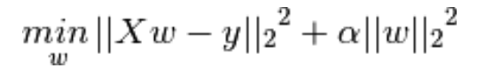
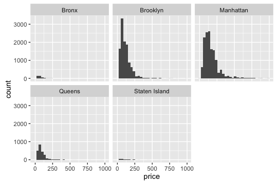
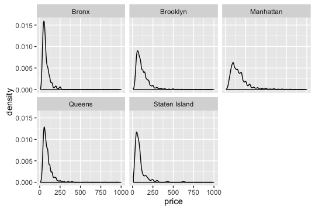
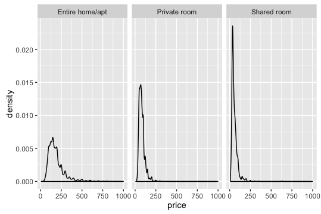
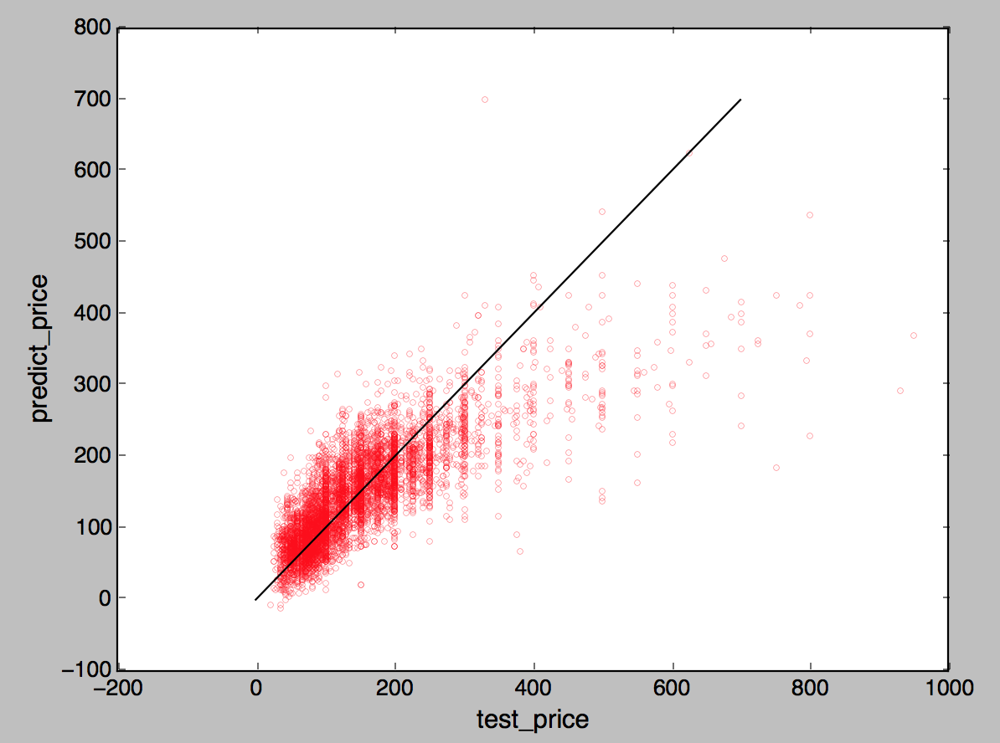

$$
\Huge{ORIE 4741 Midterm Report}
$$

# ORIE4741-Airbnb-project
### A data mining project studying Airbnb's data at Cornell University, with Dr. Madeleine Udell

The main collaborators are: 

  Yue Sun : (ys758@cornell.edu) 
  
  Zhi Ting Chen(Vincent) : (zc346@cornell.edu)
  
  Po-En Tsai: (pt369@cornell.edu)
  
  Yue Shi : (ys764@cornell.edu)
  
  <iframe width="420" height="315" src="http://matfdfdfhurl.com/z93vnu9" frameborder="0" allowfullscreen></iframe>

##1. In the report, you should describe your data set in greater detail.

This dataset is the Airbnb listing data scrapped on July 3rd, 2017. There are around 38k listings and 100 features. After cleaning the data, we have 28k listings remaining. The dataset contains features like host information, room layout, amenities provided, policy, listing prices and review scores. They are in different formats, such as boolean, integers, words and urls.
The goal of Learning from Airbnb Project is to predict the price of the listing which can maximize the profit of the hosts. Therefore, applying our model to the features of the listing, the host can get a recommended interval of the price to gain more profit.

##2. Describe how you plan to avoid over (and under) fitting

####Finding the outlier
* Some of the listing prices are unreasonable, i.e.they have extremely high prices. We try to delete the outliers by deleting data without any review scores. These rooms might not have been chosen by a lot of customers, and are therefore omitted from the analysis.

####Using home price to reflect the influence of location
* Land price is the foundation of listing price. We are grouping all the rooms into 5 neighborhoods of New York(Bronx, Manhattan, Brooklyn, Queens, and Staten Island). We then find the average home price of that area in Zillow.com to add to our analysis.

####Cutting down the dimension of features
* We have about 100 features, many of which contains sparse or non-varying values, there could be a lot of redundant information that will not likely be helpful. We will therefore use PCA to eliminate redundant features in order to find the most important features. Moreover, there are over 100 features in the original dataset, which might cause the problem of underfitting as we only have about 30k data points. Using PCA methods, the most influential features in a specific group, such as amenities, policy or room layout, can be easily figured out. In this way, we  decided to cut down the dimension of features into about 20.

##3. And how you will test the effectiveness of the models you develop.

We are separating our dataset into a training set and a test set, with 80% and 20%, respectively. By evaluating the test set error, we will how good or bad our model would generalize to other samples.
We also applied our model to other cities, to check how robust our model is when predicting listing prices in another city, which will help us find similar features that impact prices globally.

##4. Include a few histograms or other descriptive statistics about the data.

The first density plot describes the relationship between price and location. From the histograms of different locations, we can see that location will influence the price density a lot. For example, the listing prices in Bronx, Queens and Staten Island gather at lower prices and prices in Brooklyn and Manhattan have higher variance. 
Similar analysis can be applied on the density plot of price and room type.

$$
\begin{align}
\min\limits_{\omega} {||{X}^Tw-y||_2}^2+\lambda{||w||_2}^2
\end{align}
$$

