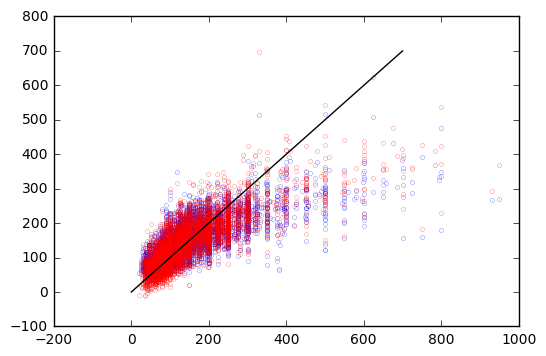

```python
import matplotlib.pyplot as plt
import pandas as pd
import numpy as np
from sklearn import datasets, linear_model
```


```python
df = pd.read_csv('df.csv',low_memory=False,index_col=False)
```

$$X=123*65a+test$$


```python
list(df.columns.values)
```


    ['Unnamed: 0',
     'price',
     'host_response_rate',
     'accommodates',
     'bathrooms',
     'bedrooms',
     'beds',
     'summary_bool',
     'neigh_overview_bool',
     'traffic',
     'superhost',
     'host_vertified',
     'guest_vertified',
     'instant_book',
     'pet',
     'party',
     'guest',
     'duration',
     'last_review_time',
     'host_acceptance',
     'availability',
     'verification_method',
     'review_scores_rating',
     'review_scores_accuracy',
     'review_scores_cleanliness',
     'review_scores_checkin',
     'review_scores_communication',
     'review_scores_location',
     'review_scores_value',
     'security_deposit',
     'cleaning_fee',
     'guests_included',
     'extra_people',
     'minimum_nights',
     'maximum_nights',
     'location_price',
     'Other pet(s)',
     'Other pet(s).1',
     'Essentials',
     'Essentials.1',
     'Carbon Monoxide Detector',
     'Carbon Monoxide Detector.1',
     'Elevator in Building',
     'Elevator in Building.1',
     'Indoor Fireplace',
     'Indoor Fireplace.1',
     'Internet',
     'Internet.1',
     'Washer',
     'Washer.1',
     'Hangers',
     'Hangers.1',
     'Buzzer/Wireless Intercom',
     'Buzzer/Wireless Intercom.1',
     'Washer / Dryer',
     'Washer / Dryer.1',
     'TV',
     'TV.1',
     'Gym',
     'Gym.1',
     'Fire Extinguisher',
     'Fire Extinguisher.1',
     'Hot Tub',
     'Hot Tub.1',
     'Cable TV',
     'Cable TV.1',
     'Air Conditioning',
     'Air Conditioning.1',
     'Suitable for Events',
     'Suitable for Events.1',
     'Kitchen',
     'Kitchen.1',
     'Family/Kid Friendly',
     'Family/Kid Friendly.1',
     'Shampoo',
     'Shampoo.1',
     'Heating',
     'Heating.1',
     'Hair Dryer',
     'Hair Dryer.1',
     'Smoke Detector',
     'Smoke Detector.1',
     'Iron',
     'Iron.1',
     'Lock on Bedroom Door',
     'Lock on Bedroom Door.1',
     'Free Parking on Premises',
     'Free Parking on Premises.1',
     'Pets live on this property',
     'Pets live on this property.1',
     'Safety Card',
     'Safety Card.1',
     'Doorman',
     'Doorman.1',
     'Dryer',
     'Dryer.1',
     'Pool',
     'Pool.1',
     'Pets Allowed',
     'Pets Allowed.1',
     'Wheelchair Accessible',
     'Wheelchair Accessible.1',
     'First Aid Kit',
     'First Aid Kit.1',
     'Dog(s)',
     'Dog(s).1',
     'Wireless Internet',
     'Wireless Internet.1',
     'Laptop Friendly Workspace',
     'Laptop Friendly Workspace.1',
     'Breakfast',
     'Breakfast.1',
     'Smoking Allowed',
     'Smoking Allowed.1',
     'Cat(s)',
     'Cat(s).1',
     '24-Hour Check-in',
     '24-Hour Check-in.1',
     'Entire home/apt',
     'Private room',
     'Shared room',
     'flexible',
     'moderate',
     'no_refunds',
     'strict',
     'super_strict_30',
     'super_strict_60',
     'within an hour',
     'within a few hours',
     'within a day',
     'a few days or more',
     'Airbed',
     'Couch',
     'Futon',
     'Pull-out Sofa',
     'Real Bed']


```python
# Use only one feature
df_X = df.iloc[:,2:]
#df_X['offset'] =1 
df_y = df.iloc[:,1]
n = len(df_y)

# Split the data into training/testing sets
df_X_train = df_X[:-int(0.2*n)]
df_X_test = df_X[-int(0.2*n):]

# Split the targets into training/testing sets
df_y_train = df_y[:-int(0.2*n)]
df_y_test = df_y[-int(0.2*n):]
```


```python
len(df_X.columns)
```


    134


```python
# Create linear regression object
regr = linear_model.LinearRegression()

# Train the model using the training sets
regr.fit(df_X_train, df_y_train)

# The coefficients
print('Coefficients: \n', regr.coef_)
# The mean squared error
print("Mean squared error: %.2f"
      % np.mean((regr.predict(df_X_test) - df_y_test) ** 2))
# Explained variance score: 1 is perfect prediction
print('Variance score: %.2f' % regr.score(df_X_test, df_y_test))
```

    ('Coefficients: \n', array([  2.78694839e+00,   1.07556804e+01,   3.43403385e+01,
             2.90219582e+01,  -3.78018664e+00,   7.98379544e-01,
            -1.36225600e-01,  -3.77328965e+00,   1.35274305e+01,
            -2.51188154e+00,  -2.80625915e+00,  -1.43148822e+00,
             2.01625866e+00,  -3.03763024e+00,   8.26521249e-01,
            -2.01283644e-03,   2.70169334e-02,  -5.88460824e+00,
             2.01147809e+01,   2.23151998e+00,   7.06730957e-01,
            -1.08854626e+00,   1.85109083e+00,  -1.51846983e+00,
            -1.55830255e+00,   1.22157623e+01,  -7.74508226e+00,
            -5.99722581e-04,   3.77645947e-01,   1.40965478e+00,
             1.34976313e-02,  -9.19684961e-02,  -8.14109313e-09,
             5.28920323e-02,  -4.88095713e+00,  -4.88095713e+00,
            -7.62261754e-02,  -7.62261751e-02,  -6.00896406e-01,
            -6.00896406e-01,   2.12248603e+00,   2.12248603e+00,
             1.25746615e+01,   1.25746615e+01,   5.90650441e-01,
             5.90650441e-01,   3.32448277e+00,   3.32448277e+00,
            -8.83083653e-01,  -8.83083653e-01,   2.51222093e+00,
             2.51222093e+00,  -1.13961321e+01,  -1.13961321e+01,
             2.09971474e+00,   2.09971474e+00,   5.46705959e+00,
             5.46705959e+00,   1.55499869e+00,   1.55499869e+00,
            -1.40984464e-01,  -1.40984464e-01,   3.65862517e+00,
             3.65862517e+00,   2.10037156e+00,   2.10037156e+00,
             7.16669203e+00,   7.16669203e+00,  -4.82077704e+00,
            -4.82077704e+00,  -1.70245394e+00,  -1.70245394e+00,
             3.23889731e+00,   3.23889731e+00,  -2.12134295e+00,
            -2.12134295e+00,   1.25974668e+00,   1.25974668e+00,
            -8.28214582e-01,  -8.28214582e-01,  -1.56608777e+00,
            -1.56608777e+00,  -8.57115579e-01,  -8.57115579e-01,
            -6.38717941e+00,  -6.38717941e+00,   1.68823252e-01,
             1.68823252e-01,  -1.33463230e+00,  -1.33463230e+00,
             9.17370918e+00,   9.17370918e+00,   8.60515039e-01,
             8.60515039e-01,   2.79271780e+00,   2.79271780e+00,
             3.75718018e-01,   3.75718018e-01,   2.42094503e+00,
             2.42094503e+00,  -5.82035227e-01,  -5.82035227e-01,
             2.46841333e-01,   2.46841333e-01,  -2.83132168e+00,
            -2.83132168e+00,  -3.75941267e-02,  -3.75941268e-02,
             1.30417403e+00,   1.30417403e+00,  -1.68000009e+00,
            -1.68000009e+00,  -3.84420931e+00,  -3.84420931e+00,
            -7.72905103e-01,  -7.72905103e-01,   4.35864105e+01,
            -1.12044242e+01,  -3.23819863e+01,  -9.23047828e+00,
            -1.32159755e+01,  -4.99063902e+01,  -1.42823752e+01,
             9.11695593e+01,  -4.53434007e+00,   4.20618347e+00,
            -1.17712712e+00,  -1.11502763e-01,  -6.59192862e-01,
            -5.46506639e+00,  -2.30338912e-01,   3.61501369e+00,
            -9.04132920e-01,   2.98452453e+00]))
    Mean squared error: 3711.89
    Variance score: 0.61
    


```python
import scipy
```


```python
w = scipy.optimize.nnls(df_X_train, df_y_train)

predict_nnls = [0 for i in range(len(df_X_test)) ]
for i in range(len(df_X_test)):
    predict_nnls[i] = sum(df_X_test.iloc[i,:]*w[0])
```


```python
w_lsq = scipy.optimize.lsq_linear(df_X_train, df_y_train)

predict_lsq = [0 for i in range(len(df_X_test)) ]
for i in range(len(df_X_test)):
    predict_lsq[i] = sum(df_X_test.iloc[i,:]*w_lsq.x)
    
#predict_lsq_train = [0 for i in range(len(df_X_train)) ]
#for i in range(len(df_X_train)):
#    predict_lsq_train[i] = sum(df_X_train.iloc[i,:]*w_lsq.x)
```


```python
# Plot outputs
plt.plot([0,700], [0,700],  color='black')
plt.scatter(df_y_test, predict_nnls, color='blue',s = 0.1, alpha = 0.5,
        linewidth=3)
plt.scatter(df_y_test, predict_lsq, color='red',s = 0.1, alpha = 0.5,
        linewidth=3)

#plt.scatter(df_y_train, predict_lsq_train, color='green',s = 0.1, alpha = 0.3,
#        linewidth=3)

#plt.xticks(())
#plt.yticks(())

plt.show()
```





```python
y = []
for i in w[0]:
    if i >0:
        y.append(True)
    else:
        y.append(False)
```


```python
y = np.array(y)
print y
```

    [False  True  True  True False False False False  True False False False
     False False False False  True False False False False False False False
     False False False False  True False False False False  True False False
     False False False False  True False  True False False False  True False
     False False False False False False False False  True False False False
     False False  True False False False False  True False False False False
     False False False False False False False False False False False False
     False False False False False False  True False  True False  True False
     False False  True False False False False False False False False False
     False False False False False False False False  True False False False
     False False False  True False False False False False False False False
     False False]
    


```python
np.set_printoptions(suppress=True)
print w[0][y]
df_X.columns[y]
```

    [   8.24438665    1.42797284   23.13880399    9.75334788    0.00620097
        0.49924414    0.03151404    2.74644327   30.19520809    4.873119
       10.11160048    9.68924129   15.47781748   22.75811772    3.27951956
        7.77533705    4.18144383   51.62494691  118.4205551 ]
    


    Index([u'accommodates', u'bathrooms', u'bedrooms', u'superhost',
           u'last_review_time', u'cleaning_fee', u'location_price',
           u'Elevator in Building', u'Indoor Fireplace', u'Washer', u'Gym',
           u'Cable TV', u'Suitable for Events.1', u'Doorman', u'Dryer', u'Pool',
           u'Wheelchair Accessible', u'Entire home/apt', u'super_strict_30'],
          dtype='object')


```python
w_lsq.x
```


    array([  2.78694816,  10.75568036,  34.34033861,  29.02195805,
            -3.78018667,   0.79837979,  -0.13622475,  -3.77328988,
            13.52743048,  -2.51188153,  -2.80625893,  -1.43148894,
             2.01625886,  -3.03763014,   0.82652119,  -0.00201284,
             0.02701693,  -5.88460824,  20.11478081,   2.23152006,
             0.70673095,  -1.08854602,   1.85109079,  -1.51846985,
            -1.55830256,  12.21576235,  -7.74508246,  -0.00059972,
             0.37764595,   1.40965479,   0.01349763,  -0.0919685 ,
            -0.00000001,   0.05289203,  -4.88095663,  -4.88095663,
            -0.07622603,  -0.07622603,  -0.60089631,  -0.60089631,
             2.12248595,   2.12248595,  12.57466136,  12.57466136,
             0.59065056,   0.59065056,   3.32448312,   3.32448312,
            -0.88308369,  -0.88308369,   2.5122207 ,   2.5122207 ,
           -11.39613292, -11.39613292,   2.0997147 ,   2.0997147 ,
             5.46705985,   5.46705985,   1.55499884,   1.55499884,
            -0.14098425,  -0.14098425,   3.65862525,   3.65862525,
             2.10037152,   2.10037152,   7.16669206,   7.16669206,
            -4.82077724,  -4.82077724,  -1.70245411,  -1.70245411,
             3.23889731,   3.23889731,  -2.1213429 ,  -2.1213429 ,
             1.25974683,   1.25974683,  -0.82821468,  -0.82821468,
            -1.56608767,  -1.56608767,  -0.85711551,  -0.85711551,
            -6.38717956,  -6.38717956,   0.16882317,   0.16882317,
            -1.33463244,  -1.33463244,   9.17370888,   9.17370888,
             0.86051481,   0.86051481,   2.79271774,   2.79271774,
             0.37571787,   0.37571787,   2.42094511,   2.42094511,
            -0.58203534,  -0.58203534,   0.24684159,   0.24684159,
            -2.83132127,  -2.83132127,  -0.03759417,  -0.03759417,
             1.30417408,   1.30417408,  -1.68000018,  -1.68000018,
            -3.84420908,  -3.84420908,  -0.77290524,  -0.77290524,
           -17.40148238, -72.19231756, -93.3698792 , -39.72442519,
           -43.70992209, -80.40033589, -44.77632176,  60.67561274,
           -35.02828699,   4.20618356,  -1.17712712,  -0.11150284,
            -0.65919284, -42.05780484, -36.82307236, -32.97772148,
           -37.49686868, -33.6082118 ])


```python
coefficient = pd.DataFrame()
coefficient['columns'] = df_X.columns
coefficient['w'] = regr.coef_
coefficient['w_lsq'] = w_lsq.x
```


```python
len(regr.coef_)
```


    134


```python
coefficient
```


<div>
<table border="1" class="dataframe">
  <thead>
    <tr style="text-align: right;">
      <th></th>
      <th>columns</th>
      <th>w</th>
      <th>w_lsq</th>
    </tr>
  </thead>
  <tbody>
    <tr>
      <th>0</th>
      <td>host_response_rate</td>
      <td>2.786948</td>
      <td>2.786948</td>
    </tr>
    <tr>
      <th>1</th>
      <td>accommodates</td>
      <td>10.755680</td>
      <td>10.755680</td>
    </tr>
    <tr>
      <th>2</th>
      <td>bathrooms</td>
      <td>34.340339</td>
      <td>34.340339</td>
    </tr>
    <tr>
      <th>3</th>
      <td>bedrooms</td>
      <td>29.021958</td>
      <td>29.021958</td>
    </tr>
    <tr>
      <th>4</th>
      <td>beds</td>
      <td>-3.780187</td>
      <td>-3.780187</td>
    </tr>
    <tr>
      <th>5</th>
      <td>summary_bool</td>
      <td>0.798380</td>
      <td>0.798380</td>
    </tr>
    <tr>
      <th>6</th>
      <td>neigh_overview_bool</td>
      <td>-0.136226</td>
      <td>-0.136225</td>
    </tr>
    <tr>
      <th>7</th>
      <td>traffic</td>
      <td>-3.773290</td>
      <td>-3.773290</td>
    </tr>
    <tr>
      <th>8</th>
      <td>superhost</td>
      <td>13.527430</td>
      <td>13.527430</td>
    </tr>
    <tr>
      <th>9</th>
      <td>host_vertified</td>
      <td>-2.511882</td>
      <td>-2.511882</td>
    </tr>
    <tr>
      <th>10</th>
      <td>guest_vertified</td>
      <td>-2.806259</td>
      <td>-2.806259</td>
    </tr>
    <tr>
      <th>11</th>
      <td>instant_book</td>
      <td>-1.431488</td>
      <td>-1.431489</td>
    </tr>
    <tr>
      <th>12</th>
      <td>pet</td>
      <td>2.016259</td>
      <td>2.016259</td>
    </tr>
    <tr>
      <th>13</th>
      <td>party</td>
      <td>-3.037630</td>
      <td>-3.037630</td>
    </tr>
    <tr>
      <th>14</th>
      <td>guest</td>
      <td>0.826521</td>
      <td>0.826521</td>
    </tr>
    <tr>
      <th>15</th>
      <td>duration</td>
      <td>-0.002013</td>
      <td>-0.002013</td>
    </tr>
    <tr>
      <th>16</th>
      <td>last_review_time</td>
      <td>0.027017</td>
      <td>0.027017</td>
    </tr>
    <tr>
      <th>17</th>
      <td>host_acceptance</td>
      <td>-5.884608</td>
      <td>-5.884608</td>
    </tr>
    <tr>
      <th>18</th>
      <td>availability</td>
      <td>20.114781</td>
      <td>20.114781</td>
    </tr>
    <tr>
      <th>19</th>
      <td>verification_method</td>
      <td>2.231520</td>
      <td>2.231520</td>
    </tr>
    <tr>
      <th>20</th>
      <td>review_scores_rating</td>
      <td>0.706731</td>
      <td>0.706731</td>
    </tr>
    <tr>
      <th>21</th>
      <td>review_scores_accuracy</td>
      <td>-1.088546</td>
      <td>-1.088546</td>
    </tr>
    <tr>
      <th>22</th>
      <td>review_scores_cleanliness</td>
      <td>1.851091</td>
      <td>1.851091</td>
    </tr>
    <tr>
      <th>23</th>
      <td>review_scores_checkin</td>
      <td>-1.518470</td>
      <td>-1.518470</td>
    </tr>
    <tr>
      <th>24</th>
      <td>review_scores_communication</td>
      <td>-1.558303</td>
      <td>-1.558303</td>
    </tr>
    <tr>
      <th>25</th>
      <td>review_scores_location</td>
      <td>12.215762</td>
      <td>12.215762</td>
    </tr>
    <tr>
      <th>26</th>
      <td>review_scores_value</td>
      <td>-7.745082</td>
      <td>-7.745082</td>
    </tr>
    <tr>
      <th>27</th>
      <td>security_deposit</td>
      <td>-0.000600</td>
      <td>-0.000600</td>
    </tr>
    <tr>
      <th>28</th>
      <td>cleaning_fee</td>
      <td>0.377646</td>
      <td>0.377646</td>
    </tr>
    <tr>
      <th>29</th>
      <td>guests_included</td>
      <td>1.409655</td>
      <td>1.409655</td>
    </tr>
    <tr>
      <th>...</th>
      <td>...</td>
      <td>...</td>
      <td>...</td>
    </tr>
    <tr>
      <th>104</th>
      <td>Wireless Internet</td>
      <td>-2.831322</td>
      <td>-2.831321</td>
    </tr>
    <tr>
      <th>105</th>
      <td>Wireless Internet.1</td>
      <td>-2.831322</td>
      <td>-2.831321</td>
    </tr>
    <tr>
      <th>106</th>
      <td>Laptop Friendly Workspace</td>
      <td>-0.037594</td>
      <td>-0.037594</td>
    </tr>
    <tr>
      <th>107</th>
      <td>Laptop Friendly Workspace.1</td>
      <td>-0.037594</td>
      <td>-0.037594</td>
    </tr>
    <tr>
      <th>108</th>
      <td>Breakfast</td>
      <td>1.304174</td>
      <td>1.304174</td>
    </tr>
    <tr>
      <th>109</th>
      <td>Breakfast.1</td>
      <td>1.304174</td>
      <td>1.304174</td>
    </tr>
    <tr>
      <th>110</th>
      <td>Smoking Allowed</td>
      <td>-1.680000</td>
      <td>-1.680000</td>
    </tr>
    <tr>
      <th>111</th>
      <td>Smoking Allowed.1</td>
      <td>-1.680000</td>
      <td>-1.680000</td>
    </tr>
    <tr>
      <th>112</th>
      <td>Cat(s)</td>
      <td>-3.844209</td>
      <td>-3.844209</td>
    </tr>
    <tr>
      <th>113</th>
      <td>Cat(s).1</td>
      <td>-3.844209</td>
      <td>-3.844209</td>
    </tr>
    <tr>
      <th>114</th>
      <td>24-Hour Check-in</td>
      <td>-0.772905</td>
      <td>-0.772905</td>
    </tr>
    <tr>
      <th>115</th>
      <td>24-Hour Check-in.1</td>
      <td>-0.772905</td>
      <td>-0.772905</td>
    </tr>
    <tr>
      <th>116</th>
      <td>Entire home/apt</td>
      <td>43.586410</td>
      <td>-17.401482</td>
    </tr>
    <tr>
      <th>117</th>
      <td>Private room</td>
      <td>-11.204424</td>
      <td>-72.192318</td>
    </tr>
    <tr>
      <th>118</th>
      <td>Shared room</td>
      <td>-32.381986</td>
      <td>-93.369879</td>
    </tr>
    <tr>
      <th>119</th>
      <td>flexible</td>
      <td>-9.230478</td>
      <td>-39.724425</td>
    </tr>
    <tr>
      <th>120</th>
      <td>moderate</td>
      <td>-13.215976</td>
      <td>-43.709922</td>
    </tr>
    <tr>
      <th>121</th>
      <td>no_refunds</td>
      <td>-49.906390</td>
      <td>-80.400336</td>
    </tr>
    <tr>
      <th>122</th>
      <td>strict</td>
      <td>-14.282375</td>
      <td>-44.776322</td>
    </tr>
    <tr>
      <th>123</th>
      <td>super_strict_30</td>
      <td>91.169559</td>
      <td>60.675613</td>
    </tr>
    <tr>
      <th>124</th>
      <td>super_strict_60</td>
      <td>-4.534340</td>
      <td>-35.028287</td>
    </tr>
    <tr>
      <th>125</th>
      <td>within an hour</td>
      <td>4.206183</td>
      <td>4.206184</td>
    </tr>
    <tr>
      <th>126</th>
      <td>within a few hours</td>
      <td>-1.177127</td>
      <td>-1.177127</td>
    </tr>
    <tr>
      <th>127</th>
      <td>within a day</td>
      <td>-0.111503</td>
      <td>-0.111503</td>
    </tr>
    <tr>
      <th>128</th>
      <td>a few days or more</td>
      <td>-0.659193</td>
      <td>-0.659193</td>
    </tr>
    <tr>
      <th>129</th>
      <td>Airbed</td>
      <td>-5.465066</td>
      <td>-42.057805</td>
    </tr>
    <tr>
      <th>130</th>
      <td>Couch</td>
      <td>-0.230339</td>
      <td>-36.823072</td>
    </tr>
    <tr>
      <th>131</th>
      <td>Futon</td>
      <td>3.615014</td>
      <td>-32.977721</td>
    </tr>
    <tr>
      <th>132</th>
      <td>Pull-out Sofa</td>
      <td>-0.904133</td>
      <td>-37.496869</td>
    </tr>
    <tr>
      <th>133</th>
      <td>Real Bed</td>
      <td>2.984525</td>
      <td>-33.608212</td>
    </tr>
  </tbody>
</table>
<p>134 rows × 3 columns</p>
</div>


```python
sum(df["flexible"])
```


    6835


